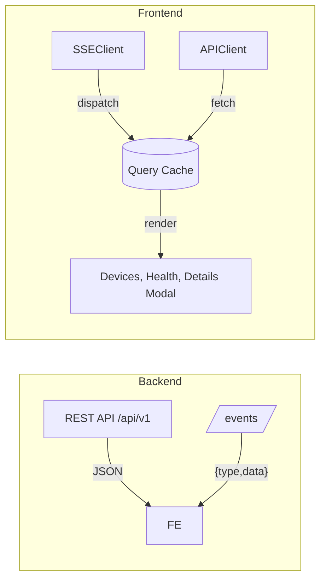

# Monitoring the Fleet – Full Documentation

This repository implements the SafelyYou Coding Challenge: Monitoring the Fleet. It includes a Go backend that exposes the required REST API and an SSE stream, and a React + TypeScript frontend that consumes the API and visualizes device health and performance.

## Contents

- [Architecture](#architecture)
- [Backend](#backend)
  - [API Endpoints](#api-endpoints)
  - [Calculations](#calculations)
  - [Run the Backend](#run-the-backend)
- [SSE Stream](#sse-stream)
- [Frontend](#frontend)
  - [Run the Frontend](#run-the-frontend)
  - [Testing & Coverage](#testing--coverage)
- [Development Notes](#development-notes)
- [File Index](#file-index)

---

## Architecture

- Backend (Go): Implements the API described in `backend/pkg/openapi.json`, initializes devices from a CSV, and exposes an SSE stream for live updates.
- Frontend (React/TS): Uses React Query for caching, an SSE client for live updates, and renders devices, health, and per-device stats.

High-level data flow:



---

## Backend

Source: `backend/`

### API Endpoints

OpenAPI spec: `backend/pkg/openapi.json` (OpenAPI 3.0.3). Base URL: `http://127.0.0.1:6733/api/v1`.

- GET `/devices` → `DeviceSummary[]`
  - Each item: `{ id: string, last_seen: RFC3339 string, status: 'online'|'offline' }`
- POST `/devices/{device_id}/heartbeat`
  - Body: `{ sent_at: RFC3339 string }`
  - 204 on success
- POST `/devices/{device_id}/stats`
  - Body: `{ sent_at: RFC3339 string, upload_time: integer (nanoseconds) }`
  - 204 on success
- GET `/devices/{device_id}/stats`
  - 200: `{ avg_upload_time: string, uptime: number }`
  - 204 if no stats

Example requests:

```bash
# Heartbeat
curl -X POST "http://127.0.0.1:6733/api/v1/devices/38-4e-73-e0-33-59/heartbeat" \
  -H "Content-Type: application/json" \
  -d '{"sent_at":"2025-01-01T12:00:00Z"}'

# Upload stats
curl -X POST "http://127.0.0.1:6733/api/v1/devices/38-4e-73-e0-33-59/stats" \
  -H "Content-Type: application/json" \
  -d '{"sent_at":"2025-01-01T12:01:00Z","upload_time":250000000}'

# Get stats
curl "http://127.0.0.1:6733/api/v1/devices/38-4e-73-e0-33-59/stats"

# List devices
curl "http://127.0.0.1:6733/api/v1/devices"
```

### Calculations

- Uptime:

```
num_minutes = minutes_between(first_heartbeat, last_heartbeat)
sum_heartbeats = count_of_received_heartbeats
uptime = (sum_heartbeats / num_minutes) * 100
```

- Average upload time: arithmetic mean of `upload_time` durations. API returns a duration string (e.g., `"5m10s"`).

### Run the Backend

From the `backend/` directory:

```bash
# Run (adjust as needed to your project layout)
go run ./cmd/server
```

The server should expose REST under `/api/v1` and SSE under `/events`.

---

## SSE Stream

Client implementation: `frontend/src/lib/sse.ts`

- Endpoint: `GET /events` (same origin as frontend).
- Message format: JSON per line `{ type: string, data: any }`.
- Events used by the app:
  - `health:update` → update `['health']` cache.
  - `devices:update` → if `{ devices: DeviceSummary[] }` present, replace cache; else if `{ id }` present, merge into cached list when the id exists.
- Status lifecycle emitted to subscribers: `'connecting' | 'connected' | 'disconnected'`.
- Reconnection:
  - Connect timeout → `disconnected` → schedule reconnect with exponential backoff.
  - Errors and idle watchdog also trigger reconnects.

---

## Frontend

Source: `frontend/`

- React Query caches:
  - `['devices']`: list of devices.
  - `['health']`: backend health snapshot.
  - `['device-stats', id]`: per-device stats.
- On mount (`src/pages/App.tsx`):
  - Subscribes to SSE `health:update` and `devices:update` and writes caches.
  - When SSE is `connected` but the devices cache is empty, calls `getDevices()` once to recover from races.
- Device details modal (`src/components/DeviceDetailsModal.tsx`):
  - Uses `useQuery` to call `getDeviceStats(id)`.
  - Shows loading, error, empty, or stats (uptime with progress bar and formatted average upload time).

### Run the Frontend

```bash
cd frontend
npm install
npm run dev
```

Open the printed local URL in your browser.

### Testing & Coverage

```bash
cd frontend
npm run test
npm run coverage
```

The suite covers SSE client behavior, React Query cache updates, UI states, and flows (e.g., heartbeats). React 18 StrictMode double-invokes effects in tests; assertions use `toHaveBeenCalled()` as needed.

---

## Development Notes

- CSV initialization: the backend reads `devices.csv` on startup to seed devices (per challenge requirement).
- No external DB necessary; all state can be in-memory.
- CORS/paths: Frontend assumes same-origin and endpoints as above. Update `sse.ts` or server routes if using different origins/paths.
- Extending:
  - Add more metrics by extending the POST/GET stats endpoints and rendering in the modal.
  - Add more SSE topics by emitting `{ type, data }` and subscribing in `App.tsx`.

---

## File Index

### Backend
- API spec: `backend/pkg/openapi.json`
- Entry point: `backend/cmd/server/main.go`
- Server logic: `backend/internal/server/`
- Data store: `backend/internal/store/`
- Device definitions: `backend/devices.csv`

### Frontend
- SSE client: `frontend/src/lib/sse.ts`
- API client: `frontend/src/api/client.ts`
- Hooks: `frontend/src/hooks/` (useSSE, useConnection, useHeartbeat)
- Components: `frontend/src/components/` (DeviceCard, DeviceDetailsModal, DevicesList, Layout)
- Main app: `frontend/src/pages/App.tsx`
- Utils: `frontend/src/utils/` (time, duration)
- Types: `frontend/src/types/api.ts`
